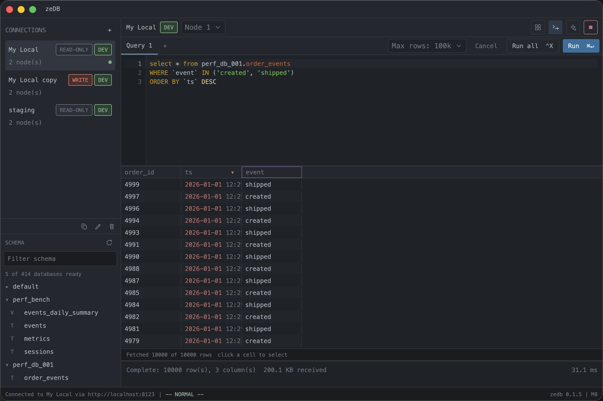
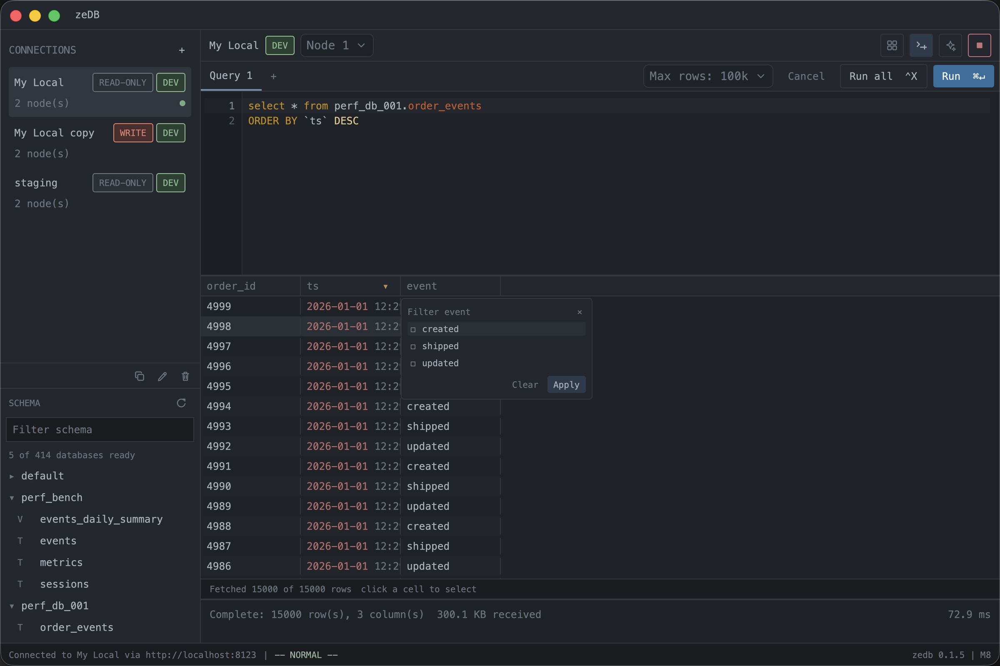
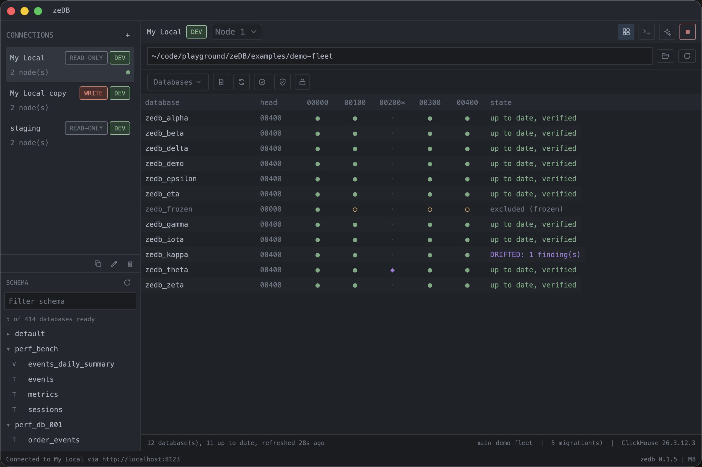

# zeDB

A fast, native ClickHouse explorer and fleet migration tool for macOS.
Built with [GPUI](https://www.gpui.rs) (the UI framework behind the Zed
editor), so it feels like an editor, not an electron app: instant
launch, native rendering, and million-row result sets that scroll
without jank.

## What you get

**A serious query workbench.**
Connect to clusters with tiered identities (dev / staging / production),
read-only by default, passwords in the macOS Keychain. Write SQL with
schema-aware completions, hover cards, and typo underlines powered by a
per-connection schema cache that persists across launches. Stream
results into a virtualized grid; sort and filter by clicking the
headers, and zeDB rewrites the actual SQL (a real `ORDER BY`, a real
`WHERE`) and re-runs just that statement, so what you see is always what
the server did.

**A migration engine that understands fleets.**
Migrations are plain SQL files in a plain git repository. zeDB replays
them through a real, version-pinned ClickHouse rather than parsing your
SQL, then shows you, across every database on the cluster, exactly what
is applied, pending, customised, or drifted, and what an apply would do
before you run it. Applying to production takes layered, explicit
consent, not a confirmation dialog.

**Your AI agents, inside the app.**
Open the agent pane (`cmd-i`) and run Claude Code, Codex, or any
ACP-speaking agent with the auth you already have. Agents see what you
see, query through zeDB's read-only, capped MCP tools, search the
schema cache instantly, and can draft migrations or queries into the
app for your review; they cannot write anything themselves.

## Install

Grab the latest DMG from
[Releases](https://github.com/RRichardsDev/zeDB/releases). zeDB checks
for updates itself and installs them in place.

## Quick start

1. Add a connection (`+` in the sidebar): name, nodes, tier, and
   whether it may ever write. Test and save.
2. Connect; you land in a query tab with the schema sidebar warming
   itself in the background.
3. Write SQL and `cmd-enter`, or click around the results grid: header
   clicks sort, right-click filters, dividers resize.
4. For migrations, open the fleet view (grid icon) and point it at a
   migration repo, or paste a git URL and let zeDB clone and manage the
   checkout for you.

## Development

Everything about building, architecture, and design decisions lives in
[DEV_README.md](DEV_README.md). The full design document is
`docs/SPEC.md`; user-facing changes land in
[CHANGELOG.md](CHANGELOG.md).

## License

Apache-2.0
